# **Peak Nutrition**

Peak Nutrition is a full stack e-commerce application that provides a platform for the nutritionist, Trish Garrett to sell and market her services and products. The intention of the site is to provide a simple, intuitive, visually appealing and user-friendly platform for users. The intended target audience is anyone with an interest in general nutrition, sports performance nutrition. The target audience will mostly be individuals, coaches, teachers, athletes, team managers.

The application implements user authorisation and full CRUD functionality, allowing users to create, update, read and delete products and articles stored in a relational database management system.

The site also features a back-end admin dashboard that allows a superuser to monitor, edit, delete products, articles, orders, users. 

Link to the live site - https://peak-nutrition.herokuapp.com/

# Contents

* [**Portfolio Five**](<#portfolio-five>)
    * [Objective](<#objective>)
    * [Site User Goals](<#site-user-goals>)
    * [Site Owner Goals](<#site-owner-goals>)
* [**Project Management**](<#project-management>)
    * [GitHub Project Board](<#github-project-board>)
    * [Database Schema](<#database-schema>)
* [**Ecommerce Business Model**](<#ecommerce-business-model>)
    * [Services to Customers](<#services-to-customers>)
    * [Value of Services](<#value-of-services>)
    * [Marketing Strategies](<#marketing-strategies>)
* [**User Experience UX**](<#user-experience-ux>)
    * [User Stories](<#user-stories>)
    * [Site Design](<#site-design>)
    * [Site Structure](<#site-structure>)
    * [Typography](<#typography>)
* [**Features**](<#features>)
    * [**Existing Features**](<#existing-features>)
        * [**Homepage**](<#homepage>)
            * [Hexagon Product Display](<#hexagon-product-display>)
            * [Free Consult Call](<#free-consult-call>)
            * [Navigation](<#navigation>)
        * [**Product Pages**](<#product-pages>)
            * [Products](<#products>)
            * [Product Details](<#product-details>)
        * [**Add Product**](<#add-product>)
            * [Add Product Form](<#add-product-form>)
            * [Add Product Notification](<#add-product-notification>)
        * [**Edit Product**](<#edit-product>)
            * [Edit Product Form](<#edit-product-form>)
            * [Edit Product Notification](<#edit-product-notification>)
        * [**Delete Product**](<#delete-product>)
            * [Delete Notification](<#delete-notification>)
        * [**Article Pages**](<#article-pages>)
            * [Articles](<#articles>)
        * [**Article Details**](<#article-details>)
            * [Article Details](<#article-details>)
            * [Form Validation](<#form-validation>)
        * [**Add Article**](<#add-article>)
            * [Add Article Form](<#add-article-form>)
            * [Add Article Notification](<#add-article-notification>)
        * [**Edit Article**](<#edit-article>)
            * [Edit Article Form](<#edit-article-form>)
            * [Edit Article Notification](<#edit-article-notification>)
        * [**Delete Article**](<#delete-article>)
            * [Delete Notification](<#delete-notification>)
        * [**Authorisation**](<#authorisation>)
            * [Sign Up](<#sign-up>)
            * [Sign In](<#sign-in>)
            * [Sign Out](<#sign-out>) 
        * [**Custom Error Pages**](<#custom-error-pages>)
            * [404 Page](<#404-page>)
            * [500 Page](<#500-page>)
    * [**Future Features**](<#future-features>)
        * [Admin Area](<#admin-area>)
        * [User Profile](<#user-profile>)
        * [Categories](<#categories>)
        * [Enhanced Form Validation](<#enhanced-form-validation>)
* [**Technologies Used**](<#technologies-used>)
    * [Languages](<#languages>)
    * [Frameworks](<#frameworks>)
    * [Software](<#software>)
    * [Libraries](<#libraries>)
* [**Testing**](<#testing>)
    * [**User Story Tests**](<#user-story-tests>)
    * [**Validator Tests**](<#validator-tests>)
        * [W3C (HTML)](<#w3c-html>)
        * [W3C (CSS)](<#w3c-css>)
        * [PEP8 (Python)](<#pep8-python>)
    * [**Input Validation Tests**](<#input-validation-tests>)
        * [Add Form Tests](<#post-product-form-tests>)
        * [Edit Form Tests](<#edit-product-form-tests>)
    * [**Additional Tests**](<#additional-tests>)
        * [Manual Tests](<#manual-tests>)
        * [Automated Tests](<#automated-tests>)
        * [Responsive Tests](<#responsive-tests>)
        * [Browser Tests](<#browser-tests>)
        * [OS Tests](<#os-tests>)
        * [Lighthouse Tests](<#lighthouse-tests>)
    * [**Bugs**](<#bugs>)
        * [Resolved](<#resolved>)
        * [Unresolved](<#unresolved>)
* [**Setup and Deployment**](<#setup-and-deployment>)
    - [Deploying the site](#deploying-the-site)
    - [Generate a SECRET KEY](#generate-a-secret-key)
    - [Heroku app setup](#heroku-app-setup)
    - [Preparation for deployment](#preparation-for-deployment)
    - [Setting up AWS](#setting-up-aws)
    - [Creating AWS groups, policies and users](#creating-aws-groups-policies-and-users)
    - [Connecting Django to the AWS S3 bucket](#connecting-django-to-AWS-s3-bucket)
    - [Stripe Setup](#stripe-setup)
* [**Forking**](<#forking>)
* [**Cloning**](<#cloning>)
* [**Credits**](<#credits>)
    * [**Content**](<#content>)
    * [**Media**](<#media>)
    * [**Code**](<#code>)

# Portfolio Five

## Objective

This product was created for Portfolio product Five submission for the Full Stack Software Development Higher National Diploma at [Code Institute](https://codeinstitute.net/). Amongst other assessment criteria, the product had to be built using HTML, CSS, JavaScript, Python and Django and feature full e-commerce ability, CRUD functionality and user authorisation. The product also had to be planned and designed using Agile methodologies. 

[Back to top](<#contents>)

## Site User Goals

- To view a list of products
- View individual product details
- Be able to easily find/see special offers/deals/promos
- See what I currently have in my basket and total cost
- Get advice about what plan/product suits me best
- Check what qualifications/expertise/experience the provider has
- Sort all items by price, category, type
- Filter items by category, type, price
- Search for an item by name or product type
- View all search results easily
- select the quantity of a product when buying
- View the items in my shopping cart
- Adjust the quantity or remove items from cart
- Easily enter payment information
- See an order confirmation screen prior to confirming my order
- Receive an order confirmation email with digital products attached where relevant

[Back to top](<#contents>)

## Site Owner Goals

- Provide a stable and enjoyable user experience that encourages product purchase.
- The platform should be accessible, welcoming and appealing to new users.
- Content should be high quality and well structured.
- Provide fully responsive application with straightforward navigation
- Ensure only authenticated and valid users have access to CRUD functionality
- Add a Product
- Update/Edit a product
- Delete a product
- Create SALE/Offers

[Back to top](<#contents>)

## Project Management

### Github Project Board

Agile methodology was used to plan and design the Peak Nutrition application. User stories were created on GitHub and added to the board in the TODO section. They then moved across the board into IN PROGRESS when they were being actioned, and then into the DONE section when they were completed. This helped greatly in tracking progress and organising and allocating work.

[Back to top](<#contents>)

### Database Schema

Database scheme was drawn up using [App Diagrams.net](https://app.diagrams.net/). The scheme was used to plan the database models and fields. It also helped to display the relationships between the models and how they interact. Peak Nutrition consists of five custom models and one generic - Product, Article, Contact, Subscription, Category and User. I did not include Keywords or Userlevels in my final design.

[Back to top](<#contents>)

# Ecommerce Business Model

## Services to Customers

### Our services include:
- Bespoke Nutrition Services: We provide customised nutrition plans tailored to the specific requirements of sports teams, clubs, schools, corporate clients, individual clients, and elite athletes. These plans are developed based on individual goals, dietary preferences, and performance objectives.
- Free 15-Minute Consultation: To ensure personalised attention and establish a strong client relationship, we offer a free 15-minute consultation. During this session, clients can discuss their goals, concerns, and requirements with our experienced nutritionists.
- Online Ordering and Payment: Through our website, customers can conveniently search for and find services that align with their needs. They can then order and pay for these services online, ensuring a seamless and efficient process.
- Subscription for Updates: Customers have the option to subscribe to our business updates. By doing so, they can stay informed about new services, promotions, and relevant industry insights. This allows us to maintain a strong connection with our clients and provide them with valuable information.

[Back to top](<#contents>)

## Value of Services

- Expertise and Customisation: Our experienced sports and performance nutritionists possess in-depth knowledge and expertise in designing customised nutrition plans. This ensures that customers receive tailored solutions to meet their specific needs, taking into account their goals, preferences, and sports requirements.
- Convenience and Accessibility: With our online platform, customers can access our services from anywhere at any time. The ease of ordering and payment enhances convenience and accessibility for our clients.
- Performance Enhancement: Our nutrition services are designed to optimise performance, aid recovery, and improve overall well-being. By focusing on individual needs and goals, we help customers achieve their maximum potential and enhance their athletic performance.

[Back to top](<#contents>)

## Marketing Strategies

- Facebook Business Page: We have established a Facebook business page to engage with our customers, share valuable content, and promote our services. Through this platform, we provide informative articles, success stories, and updates to create awareness and build a community of health-conscious individuals.

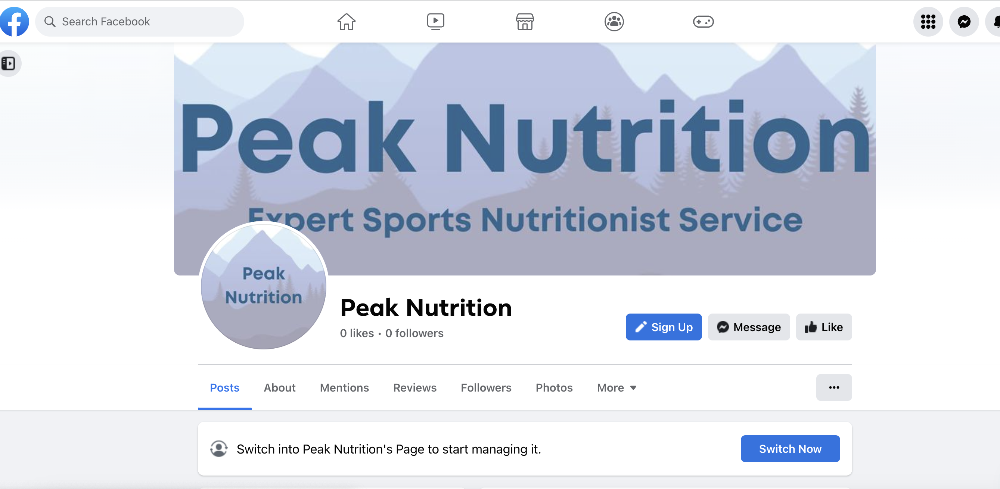
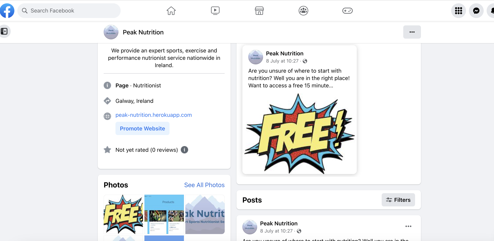

- SEO and Keyword Optimisation: We employ both long and short keywords for search engine optimisation (SEO) purposes. We also ensure meta tags are worded using keywords and phrases. This helps potential customers find our website when searching for sports and performance nutrition services online. By ranking higher in search results, we increase our visibility and attract more organic traffic.

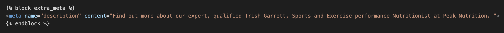
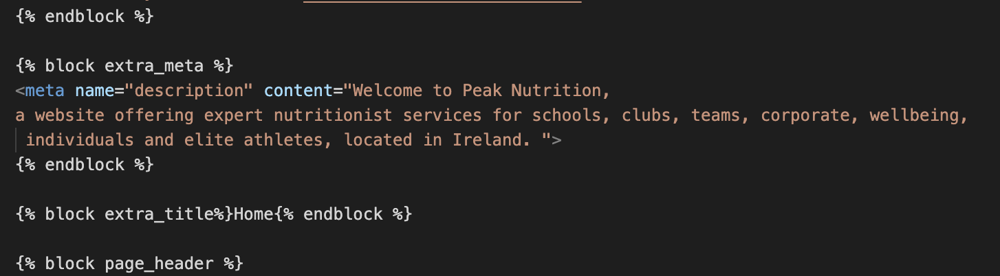
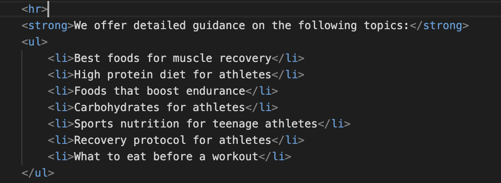

- Content Marketing: We will develop high-quality content in the form of articles, and in future, videos that provide valuable information on sports nutrition. This content is optimised for search engines to increase our website's visibility and attract organic traffic.
- Social Media Engagement: In addition to Facebook, we will use other social media platforms like Instagram, Twitter, and LinkedIn to connect with our target audience, share educational content, and engage in high quality, meaningful conversations.
- Testimonials: Ensuring that we obtain high-quality testimonials will help expand our credibility. We will proactively engage with teams and individuals who have a high profile and have a strong presence in the sports and fitness community.
- Email Marketing: We will implement an email marketing strategy to build a subscriber base and nurture relationships with potential and existing clients. Our emails will provide valuable content, exclusive offers, and updates on new services.

[Back to top](<#contents>)

# User Experience UX

## User Stories

In terms of product management, user stories are an integral part of the software development creative process. Peak Nutrition consists of 34 user stories. 

A full list of user stories can be found in the [Peak Nutrition GitHub product Board](https://github.com/users/culanomeara/projects/4).

[Back to top](<#contents>)

## Site Design 

The Peak Nutrition app features a simple and user friendly design. Balsamiq was used to do some wireframe mock ups for the homepage and articles pages.

-Index.html wireframe

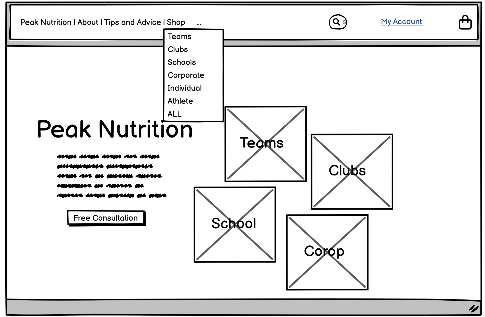

-articles.html wireframe

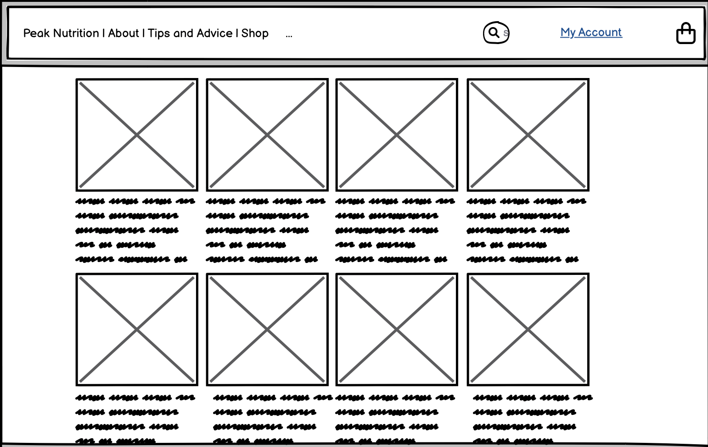

[Back to top](<#contents>)

## Site Structure 

Site structure is one that users will be quite familiar with a top navigation bar. However, some content is hidden / restricted to users who are not logged in. The main pages / templates of Peak Nutrition include - Home, Articles, Products, About, Contact. Site users can freely and easily browse the various pages using the site navigation bar which is visible at the top of each page. The nav bar options automatically change depending on whether a user is signed in, is a superuser or not logged in at all to allow for easy and intuitive site navigation and to ensure security.

[Back to top](<#contents>)

## Typography 

Peak Nutrition uses [Google Fonts](https://fonts.google.com/) for the site typography. The specific fonts are [Raleway](https://fonts.google.com/specimen/Raleway). Raleway is clear but defined with a clear, functional form.

[Back to top](<#contents>)

# Features

## Existing Features

### Homepage

The homepage is the first page of the site that a user will see when they navigate to the [Peak Nutrition URL](https://peak-nutrition.herokuapp.com/). It's designed to be eye catching to users and to quickly summarise the intention of the site. It is also a central location for all users to view the various product categories and with a call to action button for a free consultation.

#### Hexagons

I wanted the homepage to be different and eye-catching. I came across another PP5 called Paper Dreams(https://paper-dreams-uk.herokuapp.com/) and used the hexagons from that website for my homepage.

#### Free Consult Call

The homepage Free Consult Call-to-action is the large eye-catching section which is just underneath the site title. The call-to-action is only displayed on the homepage. It is used to catch the users attention, and to attract users to click. It features a large button and title.

[Back to top](<#contents>)

#### Navigation

Site navigation is present at all times on every page of the site in the form of header nav bars. These navigational elements change depending on whether a user is logged in or not and if they are superusers or not. These elements are also fully responsive and the header collapses to become a mobile menu on small screen sizes.

- Navigation Bar - Menu

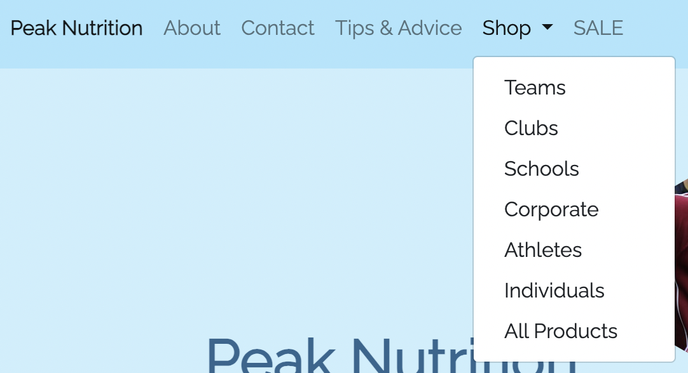

- Navigation Bar - My Account

- Navigation Bar - Search

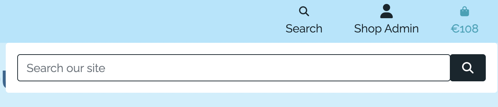

[Back to top](<#contents>)

### Product Pages

#### Products
The product page is a template used to display the list of ALL products or a specific category of products. Each product has a summary. These pages are available for all users to view, including non-logged in users. The main purpose of the page is to display the brief product overview with price. Users will generally navigate to a full product detail page by clicking on the product from the product card. As the user has now shown a specific interest in the product, all the information about the product is displayed on the details page.

- Product Page

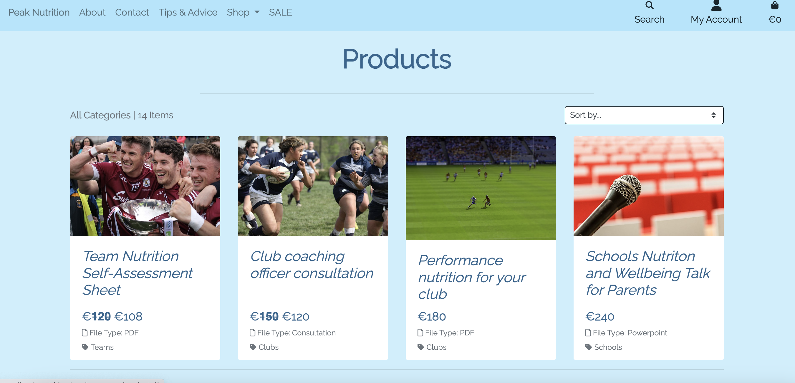

[Back to top](<#contents>)

#### Product Details
The product details page is a template used to display the full information on a product. Each product has a details page. These pages are available for all users to view, including non-logged in users. The main purpose of the page is to display the product information and price. Users will generally navigate to a full product page by clicking the product image on the product card on the product page. As the user has now shown a specific interest in the product, all the information about the product is displayed here.

- Product Details

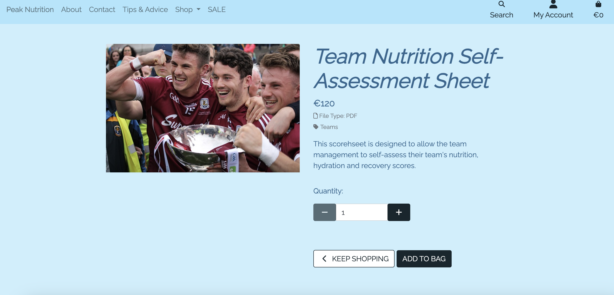

[Back to top](<#contents>)

### Add a new product

#### Add form

The Add Product template form is a page which features a product form to enable users to add a product to the Peak Nutrition site. This page is only visible to logged in superusers and appears in the navigation menu ->Shop Admin. The page features similar styling to the rest of the site for consistency.

- Product Add Form

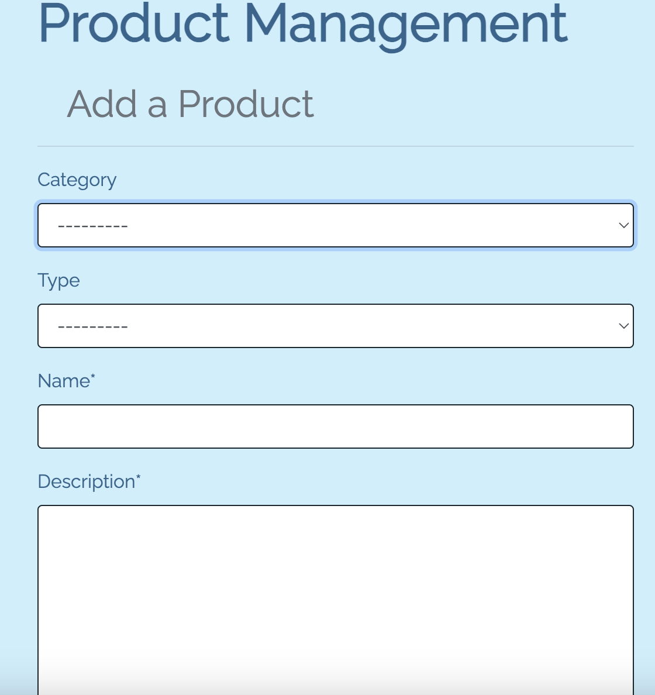

[Back to top](<#contents>)

### Edit Product

The Edit product page is available to logged in superusers. The Edit option appears below the summary on the products page and product details page. When the Edit option is clicked, the user is navigated to the edit product page. The page styling and content is exactly the same as the add page. The only difference is the form is pre-filled out with the content. The user can then use this form to edit the content and submit the amendments to overwrite the previous content.

- Edit Product Form

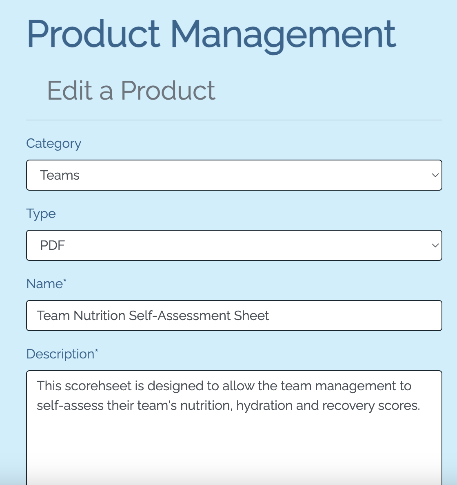

[Back to top](<#contents>)

### Delete Product

A user can delete their product easily from the relevant product page or details page. This option is only visible to a superuser. If a user clicks on delete, a delete confirmation toast is displayed.

- Delete Product

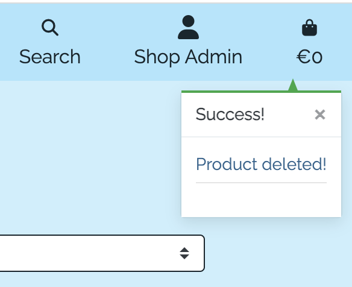

[Back to top](<#contents>)

### Add a new Article

#### Add form

The Add Article template form is a page which features a Article form to enable users to add a Article to the Peak Nutrition site. This page is only visible to logged in superusers and appears in the navigation menu. The page features similar styling to the rest of the site for consistency.

- Article Add Form

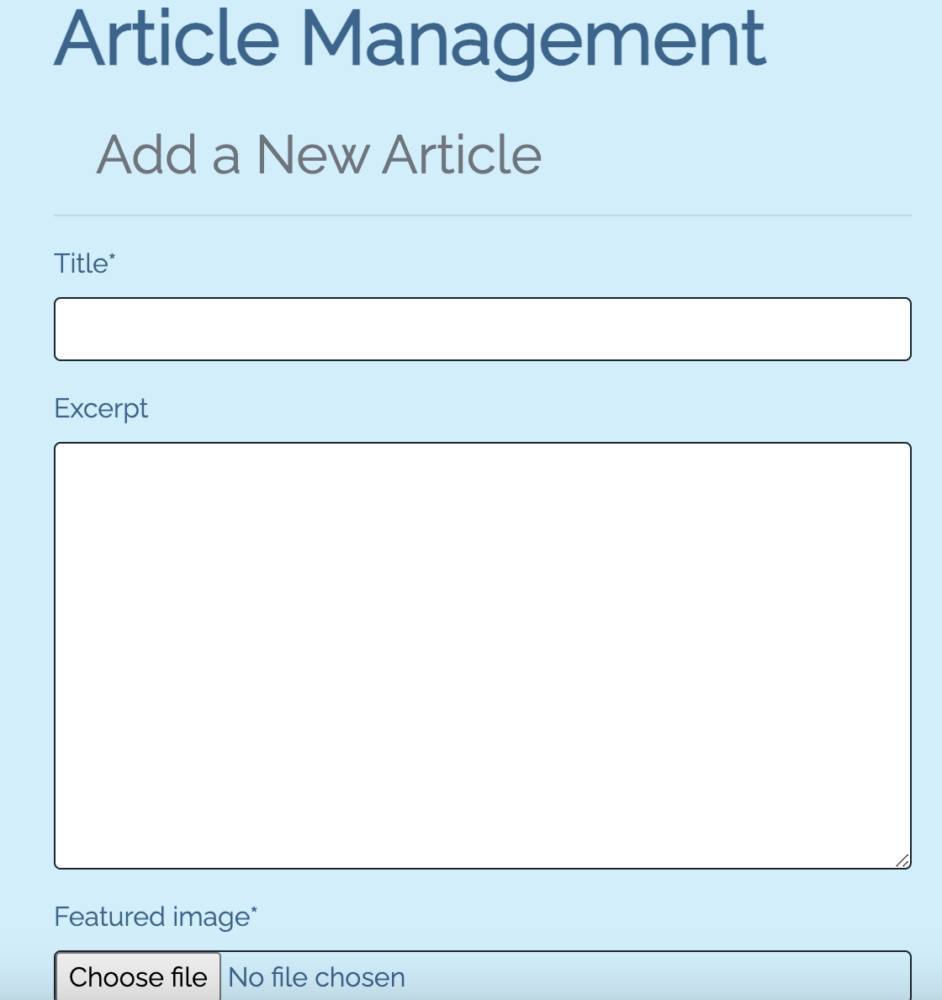

[Back to top](<#contents>)

### Edit Article

The Edit Article page is available to logged in superusers. The Edit option appears below the summary on the list page and details page. When the Update option is clicked, the user is directed to the edit Article page. The page styling and content is exactly the same as the add page. The only difference is the form is prefilled out with the content. The user can then use this form to edit the content and submit the amendments to overwrite the previous content.

- Edit Article Form

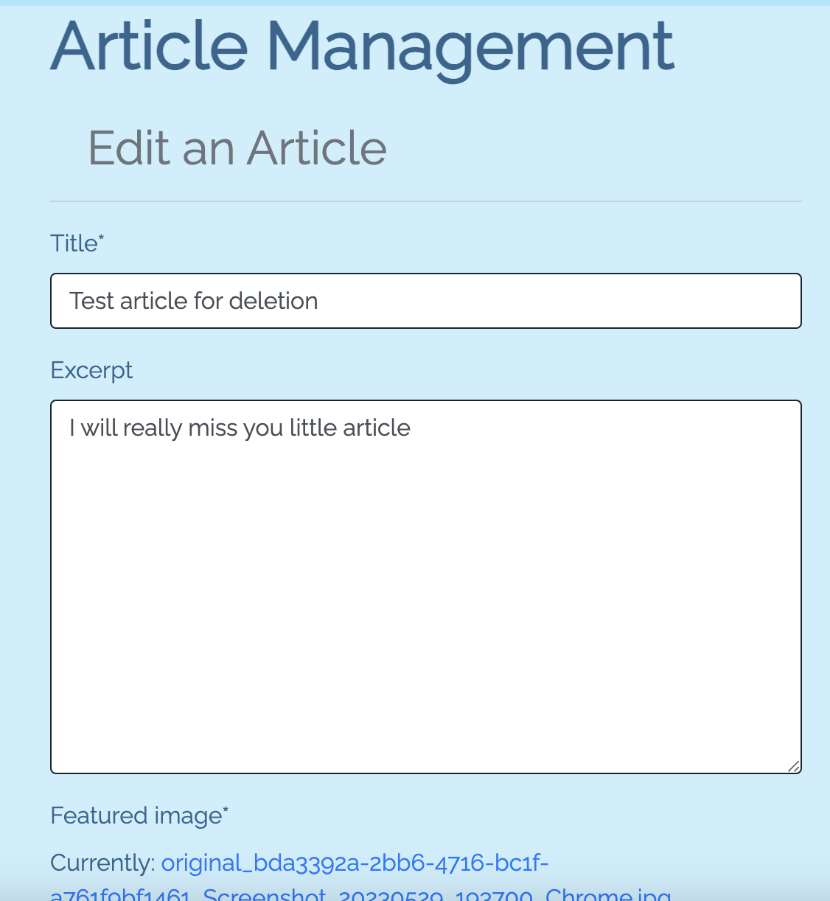

[Back to top](<#contents>)

### Delete Article

A user can delete their Article easily from the relevant article page or article details page. This option is only visible to a superuser. If a user clicks on delete, a delete confirmation toast is displayed.

[Back to top](<#contents>)

### Authorisation

#### Sign Up

A user can navigate to the sign-up page via the site navigation bars if they are not logged in. The Peak Nutrition sign up page is a built-in template from the [Django Allauth Package](https://django-allauth.readthedocs.io/en/latest/installation.html). Allauth provides the basic functionality for the user authorisation used in Peak Nutrition. Once a user submits the form correctly, they receive an verification request via email. Clicking on that link, will redirect to a confirmation page where they must click Confirm. If they do that, they will be successfully registered and receive a success toast with that message.

- Sign Up Form
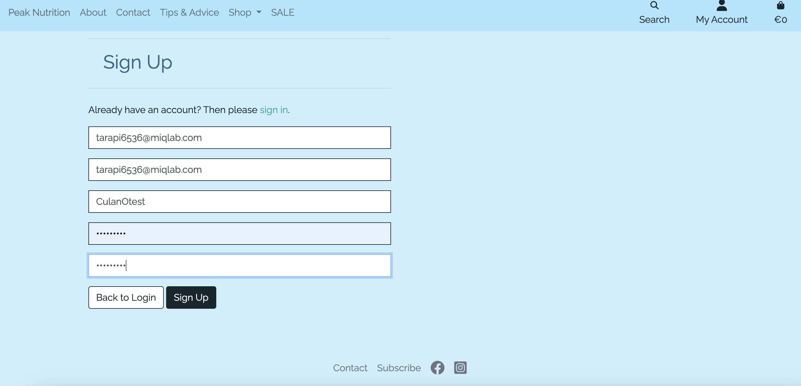

- Verification message

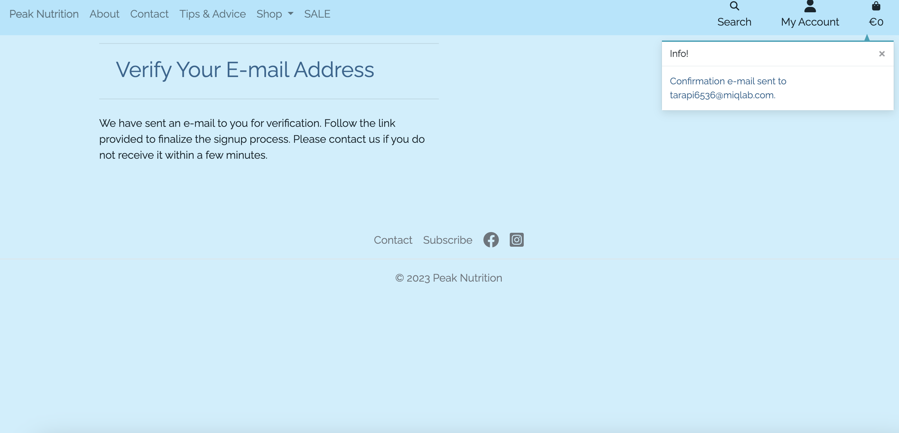

- Verification email

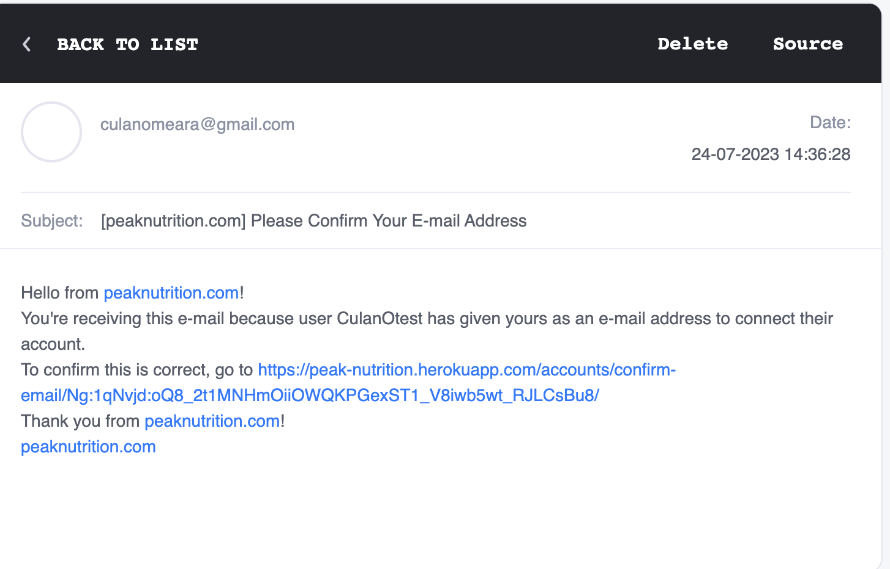

- Confirm message

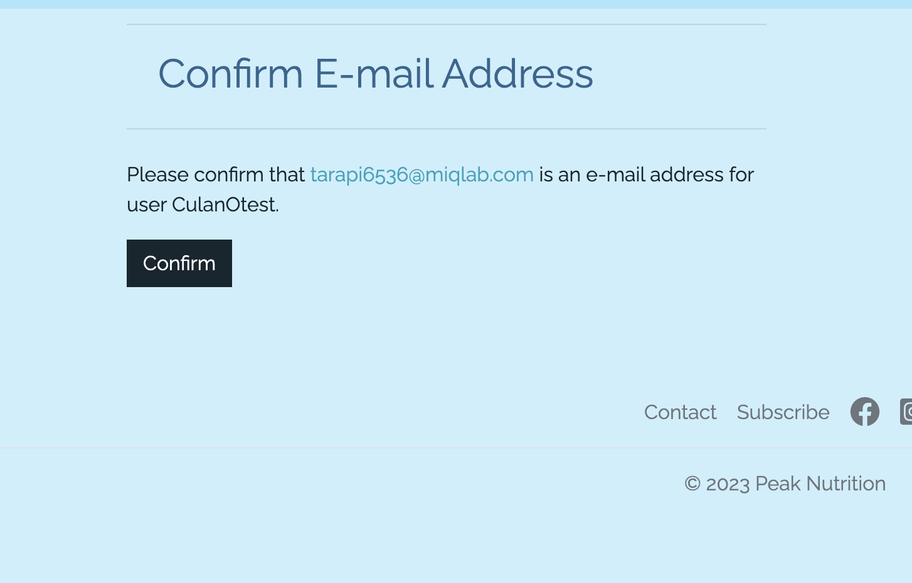

- Registration success toast

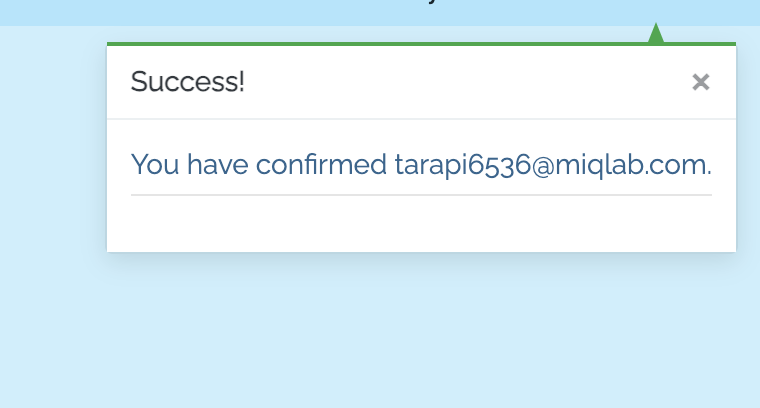

[Back to top](<#contents>)

#### Sign In

A user can navigate to the Sign in page via the site navigation -> My Account if they are not already signed in. As with the Sign-Up page, it's a built-in form. The styling of the sign in page is very similar to the rest of the user authorisation pages. The colour scheme and layout are consistent, but the form and page heading are different. Once the sign in form is submitted correctly the user is redirected to the homepage as a logged in user and they receive a success toast.

- Sign In Form

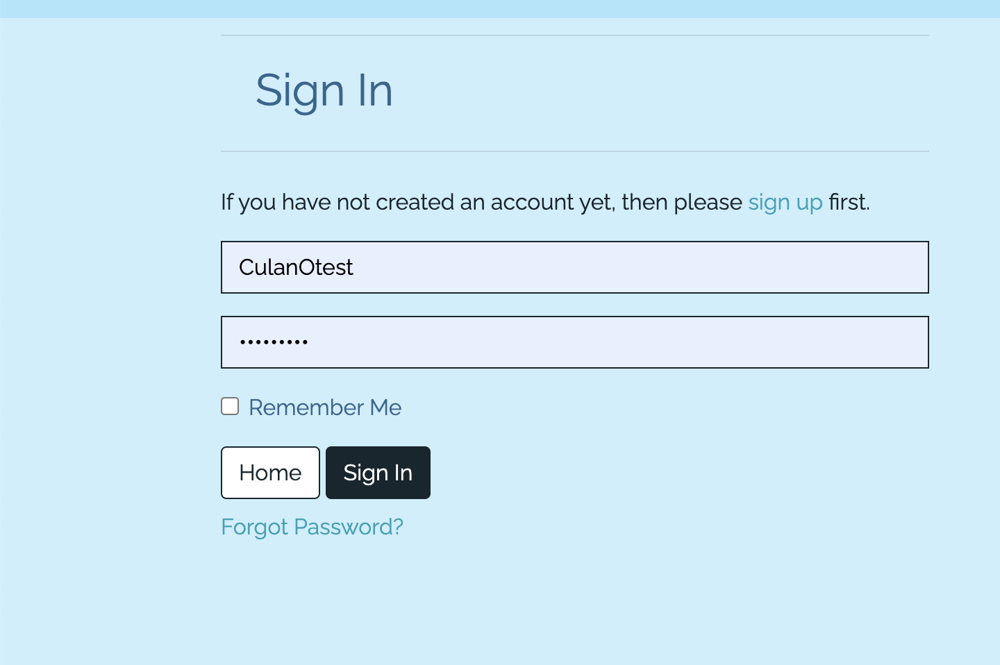

[Back to top](<#contents>)

#### Sign Out

A user can navigate to the Sign Out page via the site navigation bars if they are logged in. They are prompted on this page to confirm if wish to log out. Upon confirmation the user is logged out and redirected to the homepage. If they click on Cancel, they are brought back to the previous page.

- Sign Out Page

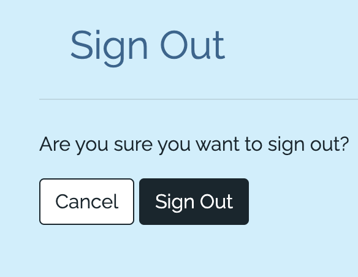

[Back to top](<#contents>)

#### 404 Page

The 404 page is triggered when a user navigates to a site URL which doesn't exist. This could be because of a number of reasons, mainly if they mistype something.

- 404 Page

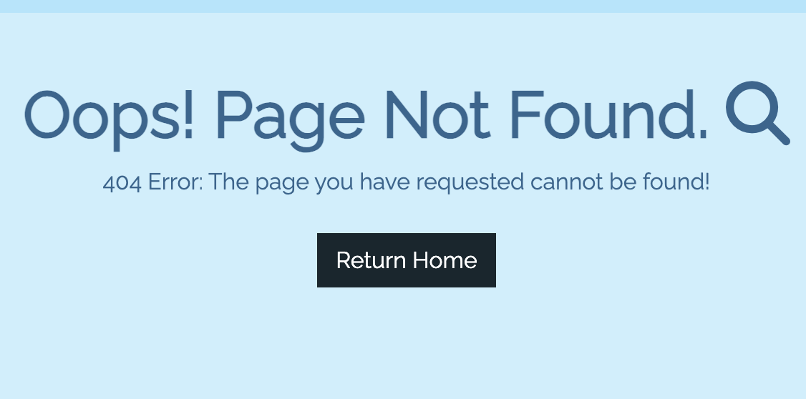

#### 500 Page

The 500 page is a catch-all error page where there is an unexplained communication breakdown between the server and user.

[Back to top](<#contents>)

## Future Features

I believe the Peak Nutrition site has a lot of potential for expansion in the future. The basic functionality is there for the MVP but there are many features I would like to add in the future.

### Admin Area

I would like to add an admin area for administrators so they wouldn't have to log into the Django admin area. The basic concept would be to have an admin navigation option on the main site navigation bar that is only visible to users with admin privileges. Navigating to this page would open a dashboard for administrators to view the basic site stats like number of site visits. This page would have to be secured and hidden from other site users.

[Back to top](<#contents>)

### User Profile

Another feature that would improve the site would be a customisable user profile section. In this section a user would be able to edit their profile. They would also be able to add a profile picture/avatar. This would greatly improve the social element of the app and the overall user experience. 

[Back to top](<#contents>)

### Categories

The Peak Nutrition site currently features category fields which don't have any usable functionality. These fields were originally intended to group products together to be displayed in product category lists/sections.

[Back to top](<#contents>)

### Enhanced Form Validation

I would like to add enhanced form validation above the built-in ones. Validation for typos, numbers instead of letters, etc

[Back to top](<#contents>)

# Technologies Used

## Languages

* [HTML5](https://developer.mozilla.org/en-US/docs/Web/HTML) - Provides the basic content and structure for the site.
* [CSS3](https://developer.mozilla.org/en-US/docs/Web/CSS) - Provides the styling for the site.
* [Python](https://www.python.org/) - Provides the functionality for the site.
* [JavaScript](https://www.javascript.com/) - Provides the timeout functionality for the messages/notifications
* [Git](https://git-scm.com/) - Provides the version control system for the site.

[Back to top](<#contents>)

## Frameworks

* [Bootstrap](https://getbootstrap.com/) - Bootstrap is a free and open-source CSS framework directed at responsive, mobile-first front-end web development. It contains HTML, CSS and JavaScript-based design templates for typography, forms, buttons, navigation, and other interface components.
* [Django](https://www.djangoproduct.com/) - Django is a free and open-source, Python-based web framework that follows the model–template–views architectural pattern.

[Back to top](<#contents>)

## Software

* [GitHub](https://github.com/) - An internet hosting service used for version control. Used to host the Peak Nutrition repository and for the product board used for product management and user stories.
* [GitPod](https://www.gitpod.io/) - A cloud development environment used as the primary site code editor.
* [Heroku](https://dashboard.heroku.com/) - A cloud platform used to host the Peak Nutrition full stack application.
* [Stripe](https://stripe.com/) - E-commerce software and APIs to accept payments, send payouts, and manage shop orders
* [Amazon Web Services](https://aws.amazon.com/) - a cloud platform that allows you to store and retrieve static files
* [Slack](https://slack.com/intl/en-gb/) - An online instant messaging program used for site feedback and guidance from the [Code Institute](https://codeinstitute.net/) community.
* [App Diagrams](https://app.diagrams.net/) - An online diagram software used for the database schemas.
* [Google Chrome Dev Tools](https://developer.chrome.com/docs/devtools/) - A set of web developer tools built directly into the chrome browser. Used for responsiveness tests and further testing.
* [Google Fonts](https://fonts.google.com/) - A web-based font service by Google used to supply the site typography.
* [Lighthouse](https://developer.chrome.com/docs/lighthouse/overview/) - An open-source automated testing tool used for site tests.
* [Responsive Design Checker](https://responsivedesignchecker.com/) - An online testing tool used for responsive site testing.
* [Am I Responsive](https://ui.dev/amiresponsive) - An online testing tool used for responsive site testing.
* [Wave Web Accessibility Evaluation Tool](https://wave.webaim.org/) - An online suite of evaluation tools used to test the site for accessibility.

[Back to top](<#contents>)

## Libraries

This is a list of the Python / Django libraries used in this product.

* [asgiref](https://github.com/django/asgiref) - A standard Python library to allow for asynchronous web apps and servers to communicate with each other.
* [boto3](https://pypi.org/product/boto3/) - Boto3 is the Amazon Web Services (AWS) Software Development Kit (SDK) for Python, which allows Python developers to write software that makes use of services like Amazon S3 and Amazon EC2.
* [botocore](https://pypi.org/product/botocore/) - A low-level interface to a growing number of Amazon Web Services. The botocore package is the foundation for the AWS CLI as well as boto3
* [dj-database-url](https://pypi.org/product/dj-database-url/) - A Django utility to utilise the DATABASE_URL environment variable to configure the Django application. Used with PostgreSQL.
* [Django](https://www.djangoproduct.com/) - A python package for the Django framework.
* [django-allauth](https://django-allauth.readthedocs.io/en/latest/) - An integrated set of Django applications addressing user authentication, registration and account management.
* [django-countries](https://pypi.org/product/django-countries/) - Provides a country field for Django models.
* [django-storages](https://pypi.org/product/django-storages/) - Collection of custom storage backends for Django.
* [django-crispy-forms](https://django-crispy-forms.readthedocs.io/en/latest/) - A Django package that provides tags and filters to control the rendering behaviour of Django forms.
* [gunicorn](https://gunicorn.org/) - A Python WSGI HTTP Server for UNIX.
* [jmespath](https://jmespath.org/) - JMESPath is a query language for JSON.
* [oauthlib](https://github.com/oauthlib/oauthlib) - A generic, spec-compliant, thorough implementation of the OAuth request-signing logic for Python 3.6+.
* [psycopg2](https://pypi.org/product/psycopg2/) - A PostgreSQL database adapter for Python.
* [Pillow](https://pypi.org/product/Pillow/) - The Python Imaging Library adds image processing capabilities to your Python interpreter.
* [python3-openid](https://pypi.org/product/python3-openid/) - A set of Python packages to support use of the OpenID decentralised identity system.
* [pytz](https://pypi.org/product/pytz/) - A Python package for world timezone definitions, modern and historical.
* [requests-oauthlib](https://pypi.org/product/requests-oauthlib/) - A Python package for OAuthlib authentication support for Requests.
* [sqlparse](https://pypi.org/product/sqlparse/) - A non-validating SQL parser for Python.
* [urllib3](https://pypi.org/product/urllib3/) - HTTP library with thread-safe connection pooling, file post, and more.

[Back to top](<#contents>)

## Testing

### User Story Tests

### Shopper
1. I want to be able to view product list

**Step** | **Expected Result** | **Actual Result**
------------ | ------------ | ------------ |
Navigate to https://peak-nutrition.herokuapp.com/ | Home page main body loads with unique hexagon styling displaying the product categories | Works as expected |

2. I can view individual product details 

**Step** | **Expected Result** | **Actual Result**
------------ | ------------ | ------------ |
Navigate to https://peak-nutrition.herokuapp.com/products/ | Select a product and click on the link image | Works as expected |

3. I want to be able to easily find/see special offers/deals/promos

**Step** | **Expected Result** | **Actual Result**
------------ | ------------ | ------------ |
Navigate to https://peak-nutrition.herokuapp.com/ | At top nav bar, you can click on the SALE link | Works as expected |

4. I want to be able to see what I currently have in my basket and total cost

**Step** | **Expected Result** | **Actual Result**
------------ | ------------ | ------------ |
Navigate to https://peak-nutrition.herokuapp.com/ and click on basket icon in nav bar | Bag contents and cost will appear | Works as expected |

5. I would like to get advice about what plan/product suits me best

**Step** | **Expected Result** | **Actual Result**
------------ | ------------ | ------------ |
Navigate to https://peak-nutrition.herokuapp.com/ and click on Book A Free Consult | User will enter details to get a free 15 min consultation | Works as expected |

6. I want to check what qualifications/expertise/experience the provider has

**Step** | **Expected Result** | **Actual Result**
------------ | ------------ | ------------ |
Navigate to https://peak-nutrition.herokuapp.com/about | Information about nutritionist is displayed | Works as expected |

7. I want to sort all items by price, category, type

**Step** | **Expected Result** | **Actual Result**
------------ | ------------ | ------------ |
Navigate to https://peak-nutrition.herokuapp.com/products | Use dropdown menu to sort products | Works as expected |

8. I want to be able to filter items by category

**Step** | **Expected Result** | **Actual Result**
------------ | ------------ | ------------ |
Navigate to https://peak-nutrition.herokuapp.com/products | Click on desired Product Category Tag and all items in that category will be displayed | Works as expected |
Navigate to https://peak-nutrition.herokuapp.com/| Click on desired Product Category Hexagon and all items in that category will be displayed | Works as expected |
Navigate to https://peak-nutrition.herokuapp.com/| Click on SHOP nav item, then select desired Product Category and all items in that category will be displayed | Works as expected |

9. I want to be able to search for an item

**Step** | **Expected Result** | **Actual Result**
------------ | ------------ | ------------ |
Navigate to https://peak-nutrition.herokuapp.com/ , click on search icon in nav bar and enter search term | Search results are displayed | Works as expected |

10. I want to be able to view all search results easily
------------ | ------------ | ------------ |
Navigate to https://peak-nutrition.herokuapp.com/ , click on search icon in nav bar and enter search term | Search results are displayed in an easy to view way | Works as expected |

16. I want to be able to select the quantity of a product when buying

**Step** | **Expected Result** | **Actual Result**
------------ | ------------ | ------------ |
Navigate to https://peak-nutrition.herokuapp.com/ , select a product to buy, a quantity selector will appear | Clicking Plus or Minus will alter quantity. Typing in a number between 1 and 99 also possible. | Works as expected |

17. I want to be able to view the items in my shopping cart

**Step** | **Expected Result** | **Actual Result**
------------ | ------------ | ------------ |
Navigate to https://peak-nutrition.herokuapp.com/bag | Bag contents and cost will appear | Works as expected |

18. I want to be able to adjust the quantity or remove items from cart

**Step** | **Expected Result** | **Actual Result**
------------ | ------------ | ------------ |
Navigate to https://peak-nutrition.herokuapp.com/bag  | User can click PLUS or MINUS then UPDATE or click REMOVE | Works as expected |

19. I want to be able to easily enter payment information

**Step** | **Expected Result** | **Actual Result**
------------ | ------------ | ------------ |
Navigate to https://peak-nutrition.herokuapp.com/bag then click in Secure Checkout | User can enter payment details using built-in Stripe element | Works as expected |

20. I want to be able to see an order confirmation prior to confirming my order

**Step** | **Expected Result** | **Actual Result**
------------ | ------------ | ------------ |
Navigate to https://peak-nutrition.herokuapp.com/checkout/ | User can view order summary on screen | Works as expected |

21. I want to be able to receive an order confirmation email once an order is complete

**Step** | **Expected Result** | **Actual Result**
------------ | ------------ | ------------ |
Navigate to https://peak-nutrition.herokuapp.com/checkout/ and complete purchase | Order confirmation is emailed to user once payment successfully gone thru | Works as expected |

26. I want to easily navigate the site

**Step** | **Expected Result** | **Actual Result**
------------ | ------------ | ------------ |
Navigate to https://peak-nutrition.herokuapp.com/ | Navigate using the nav menu or search desired terms | Works as expected |

29. I want to get notified when I add, adjust or remove items from my shopping bag

**Step** | **Expected Result** | **Actual Result**
------------ | ------------ | ------------ |
Navigate to https://peak-nutrition.herokuapp.com/bag | When adding, adjusting or removing items a success toast message appears in top right of screen | Works as expected |

30. I want to get a preview of my shopping bag when I add, adjust or remove an item

**Step** | **Expected Result** | **Actual Result**
------------ | ------------ | ------------ |
Navigate to https://peak-nutrition.herokuapp.com/bag | When adding, adjusting or removing items a success toast message appears in top right of screen giving a preview of the bag also | Works as expected |

### Shop Owner

22. As a shop owner, I can add a new product

**Step** | **Expected Result** | **Actual Result**
------------ | ------------ | ------------ |
Navigate to https://peak-nutrition.herokuapp.com/ logged in as superuser. Click on Shop Admin on nav bar and select Add Product | Add Product Form is displayed | Works as expected |

23. As a shop owner, I can Update/Edit a product

**Step** | **Expected Result** | **Actual Result**
------------ | ------------ | ------------ |
Navigate to https://peak-nutrition.herokuapp.com/ logged in as superuser | On Products page or product details page, Edit Button can be clicked on. This will display the Edit product form | Works as expected |

24. As a shop owner, I can delete a product

**Step** | **Expected Result** | **Actual Result**
------------ | ------------ | ------------ |
Navigate to https://peak-nutrition.herokuapp.com/ logged in as superuser | On Products page or product details page, Delete Button can be clicked on | Works as expected |

25. As a shop owner, I can create SALE/Offers

**Step** | **Expected Result** | **Actual Result**
------------ | ------------ | ------------ |
Navigate to https://peak-nutrition.herokuapp.com/ logged in as superuser. Click on Shop Admin on nav bar and select Add Product and add a discount to new product | Add Product Form is displayed | Works as expected |
Navigate to https://peak-nutrition.herokuapp.com/ logged in as superuser | On Products page or product details page, Edit Button can be clicked on. This will display the Edit product form where owner can add a discount | Works as expected |

31. As a shop owner, I can add a new article

**Step** | **Expected Result** | **Actual Result**
------------ | ------------ | ------------ |
Navigate to https://peak-nutrition.herokuapp.com/ logged in as superuser. Click on Shop Admin on nav bar and select Add Article | Add Article Form is displayed | Works as expected |

32. As a shop owner, I can Update/Edit an article

**Step** | **Expected Result** | **Actual Result**
------------ | ------------ | ------------ |
Navigate to https://peak-nutrition.herokuapp.com/ logged in as superuser | On Articles page or article details page, Edit Button can be clicked on. This will display the Edit article form | Works as expected |

33. As a shop owner, I can delete an article

**Step** | **Expected Result** | **Actual Result**
------------ | ------------ | ------------ |
Navigate to https://peak-nutrition.herokuapp.com/ logged in as superuser | On Articles page or article details page, Delete Button can be clicked on.| Works as expected |

34. Ensure only logged-in users can add, edit, delete products and articles

**Step** | **Expected Result** | **Actual Result**
------------ | ------------ | ------------ |
Navigate to https://peak-nutrition.herokuapp.com/ not logged in | Shop Admin nav item is no longer available. Edit, delete buttons are not visible. If you try to access url directly(e.g. https://peak-nutrition.herokuapp.com/accounts/login/?next=/articles/add/), it redirects to sign in page | Works as expected |

36. As a shop owner, I want the user to come to a custom 404 error page that explains in simple language what has gone wrong if they enter a URL that they don't have permission to access

**Step** | **Expected Result** | **Actual Result**
------------ | ------------ | ------------ |
Navigate to a page that doesn't exist: (e.g. https://peak-nutrition.herokuapp.com/accrw) | A customised 404 page is displayed | Works as expected |

### Site User

11. As a site user, I want to be able to register an account

**Step** | **Expected Result** | **Actual Result**
------------ | ------------ | ------------ |
Navigate to https://peak-nutrition.herokuapp.com/. Click on My Account -> Register | Sign Up Page displayed | Works as expected |

13. As a site user, I want to be able to log in and out of my account

**Step** | **Expected Result** | **Actual Result**
------------ | ------------ | ------------ |
Navigate to https://peak-nutrition.herokuapp.com/. Click on My Account -> Sign In | Sign In Page displayed | Works as expected |
Navigate to https://peak-nutrition.herokuapp.com/. Click on Shop Admin -> Sign Out | Sign Out Page displayed | Works as expected |

14. As a site user, I want to be reset my password

**Step** | **Expected Result** | **Actual Result**
------------ | ------------ | ------------ |
Navigate to https://peak-nutrition.herokuapp.com/accounts/password/reset/ | Password reset form is displayed | Works as expected |

15. As a site user, I want to receive confirmation of registration

**Step** | **Expected Result** | **Actual Result**
------------ | ------------ | ------------ |
Navigate to https://peak-nutrition.herokuapp.com/accounts/signup/ | Once Sign Up is completed and email verified, toast success message appears confirming registration | Works as expected |

35. As a site user, I want to be able to subscribe to website updates/newsletter

**Step** | **Expected Result** | **Actual Result**
------------ | ------------ | ------------ |
Navigate to https://peak-nutrition.herokuapp.com/contact | Click Subscribe box at bottom of contact form and user is added to subscription list | Works as expected |
Navigate to https://peak-nutrition.herokuapp.com/contact/free | Click Subscribe box at bottom of the free consult form and user is added to subscription list | Works as expected |
Click on Subscribe button in footer on any page | Enter details and user is added to subscription list | Works as expected | 

### Performing tests on various devices

The website was tested using Google Chrome Developer Tools Toggle Device Toolbar to simulate viewports of different devices.

The website was tested on the following devices:
- MacBook Pro with macOS 13.2
- MS Surface Pro Windows 10
- Samsung s20 with Android v13

## Validator Tests

### W3C (HTML)

When the Peak Nutrition site was first tested with the [W3C HTML Markup Validation Service](https://validator.w3.org/) it showed one error and one warning. The error was for a stray footer which was resolved by moving it inside body end tag. The warning was regarding script type attribute which I removed as was no longer required.

[HTML link](https://validator.w3.org/nu/?doc=https%3A%2F%2Fpeak-nutrition.herokuapp.com%2F)

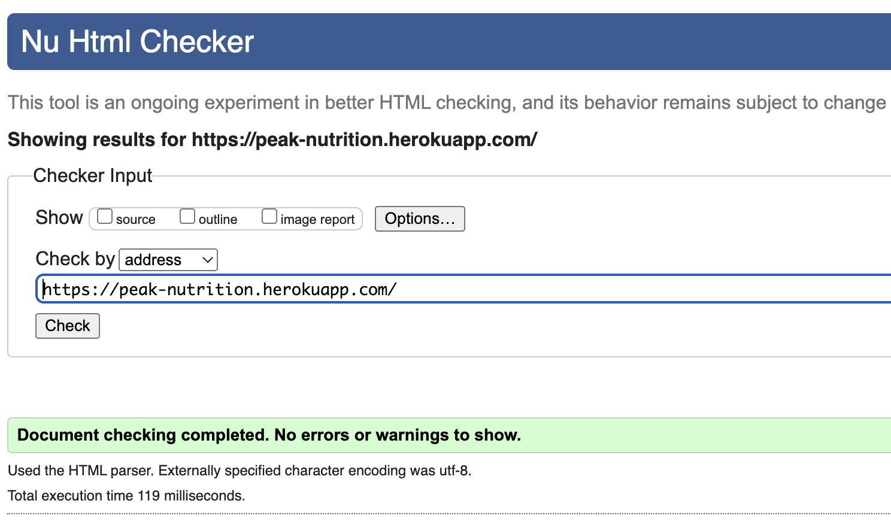

- All Products Page

[HTML link](https://validator.w3.org/nu/?doc=https%3A%2F%2Fpeak-nutrition.herokuapp.com%2Fproducts%2F)

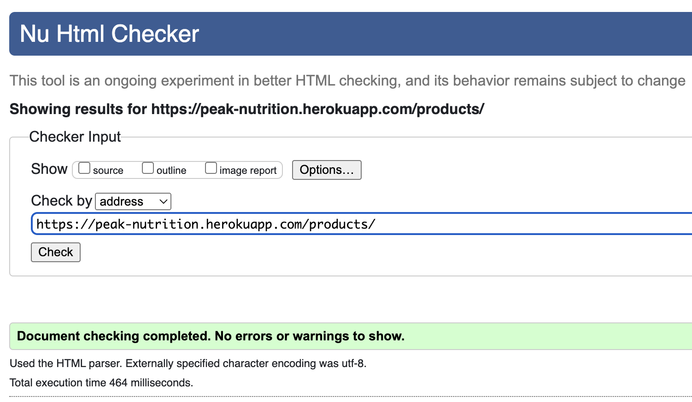

- Articles Page

[HTML link](https://validator.w3.org/nu/?doc=https%3A%2F%2Fpeak-nutrition.herokuapp.com%2Farticles%2F)

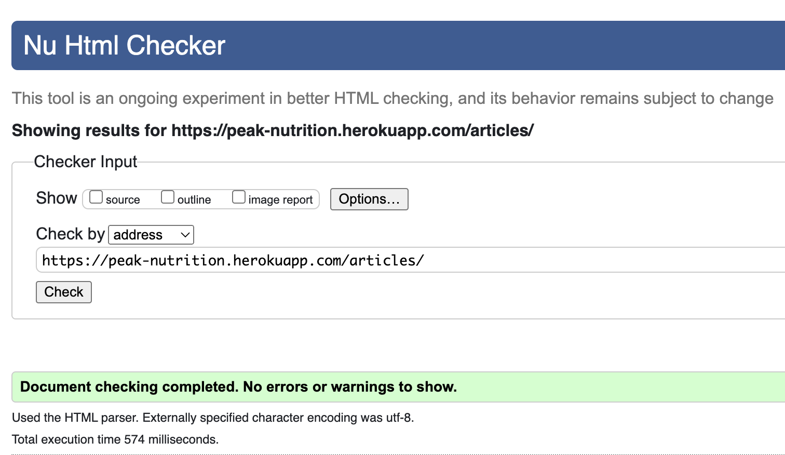

- Sign In Page

[HTML link](https://peak-nutrition.herokuapp.com/accounts/login/)

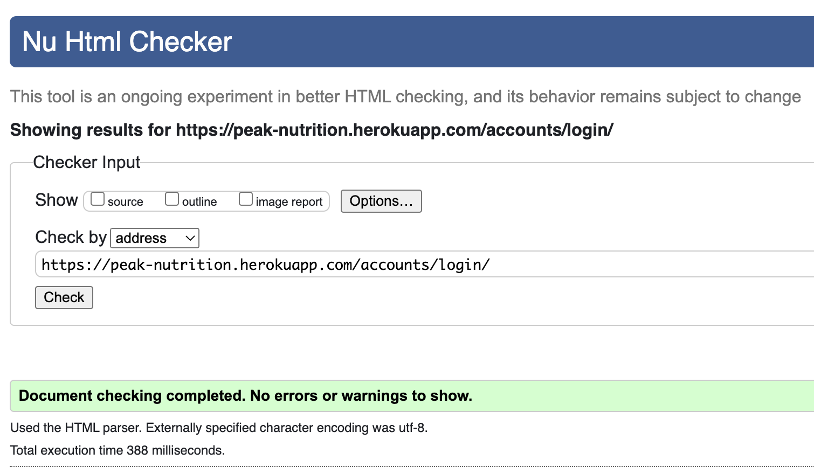

[Back to top](<#contents>)

- About Page

This gave a stray p tag error which was unresolved as there was no stray tag found in the code.

[HTML link](https://peak-nutrition.herokuapp.com/about/)

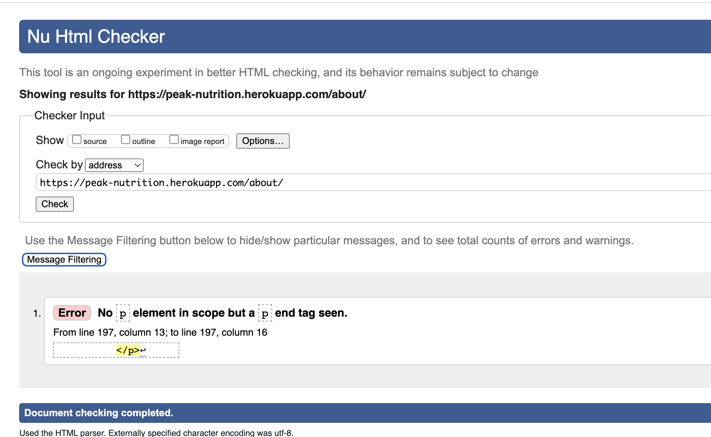

### W3C (CSS)

The Peak Nutrition CSS stylesheet has been assessed using the [W3C CSS Validation Service](https://jigsaw.w3.org/css-validator/) by direct input. Unfortunately there is an error that I was unable to resolve.

[CSS link](https://jigsaw.w3.org/css-validator/)

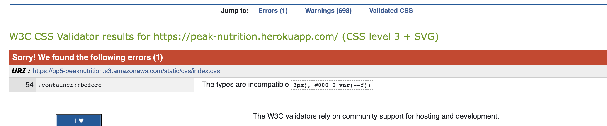

[Back to top](<#contents>)

### PEP8 (PYTHON)

I used the new [Code Institute Python Linter](https://pep8ci.herokuapp.com/) to test all of the Peak Nutrition python code files. All passed without error except for settings.py.

#### settings.py
Has four max line length errors

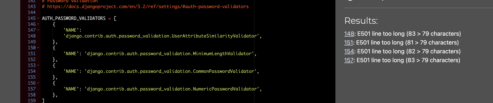

[Back to top](<#contents>)

## JSHint

The Peak Nutrition Javascript has been assessed using [JSHint](https://jshint.com/) by direct input. There were two warnings shown for stripe_elements.js: 'template literal syntax' is only available in ES6 (use 'esversion: 6'). As this is from stripe library code I ignored these.

## Input Validation Tests

### Add Form Tests

### Edit Form Tests

### Responsive Tests

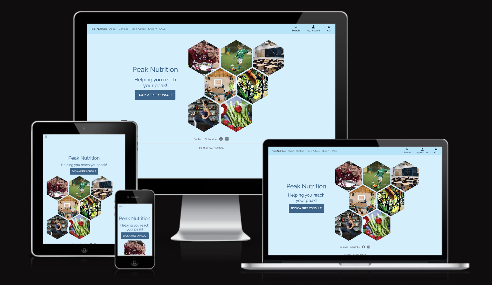

[Back to top](<#contents>)

### Browser Tests

#### Site tested in:

- Google Chrome

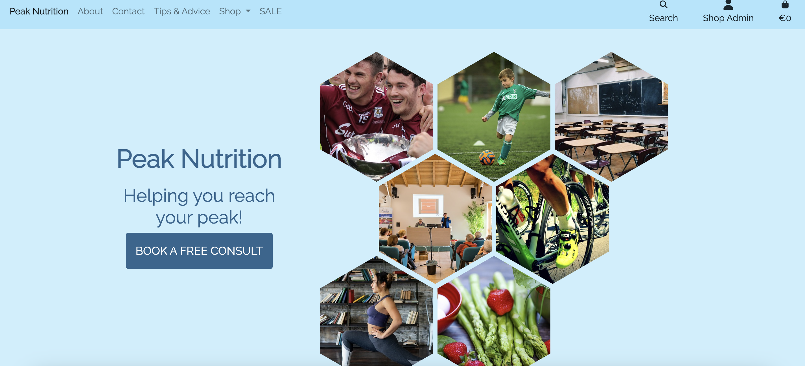

- Apple Safari

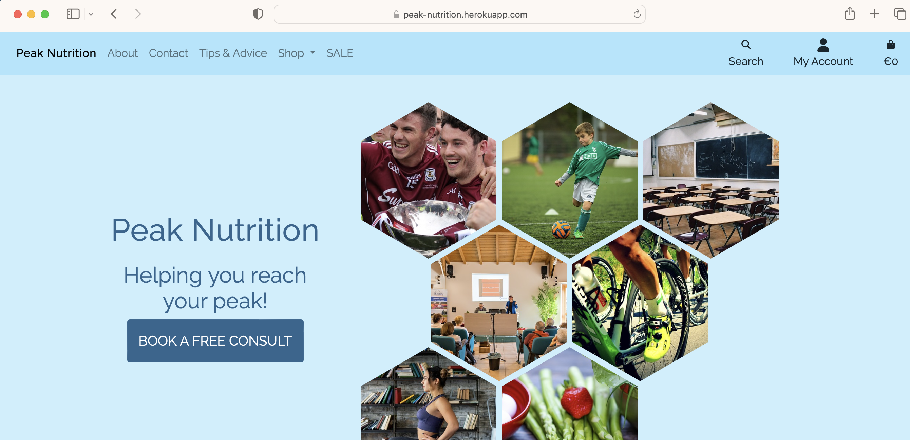

- Mozilla Firefox

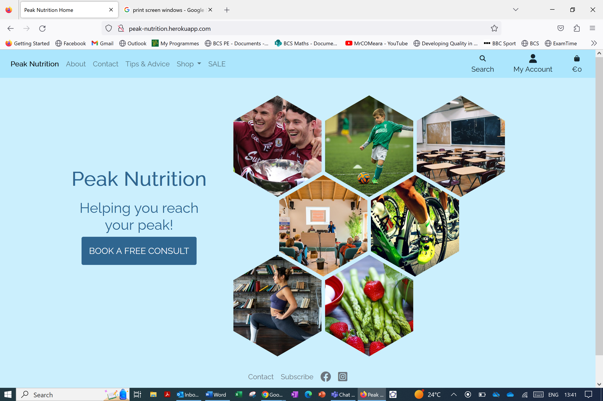

- Microsoft Edge

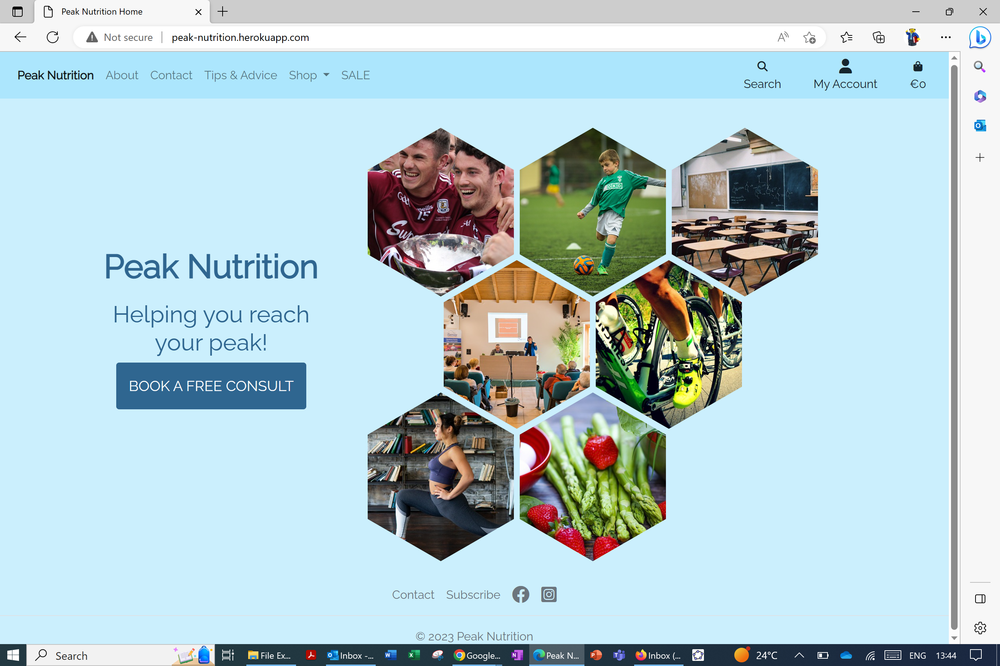

[Back to top](<#contents>)

### OS Tests

Site was developed on an Apple MacBook using iOS v13.2

#### Site tested in:

- Windows 10 PRO

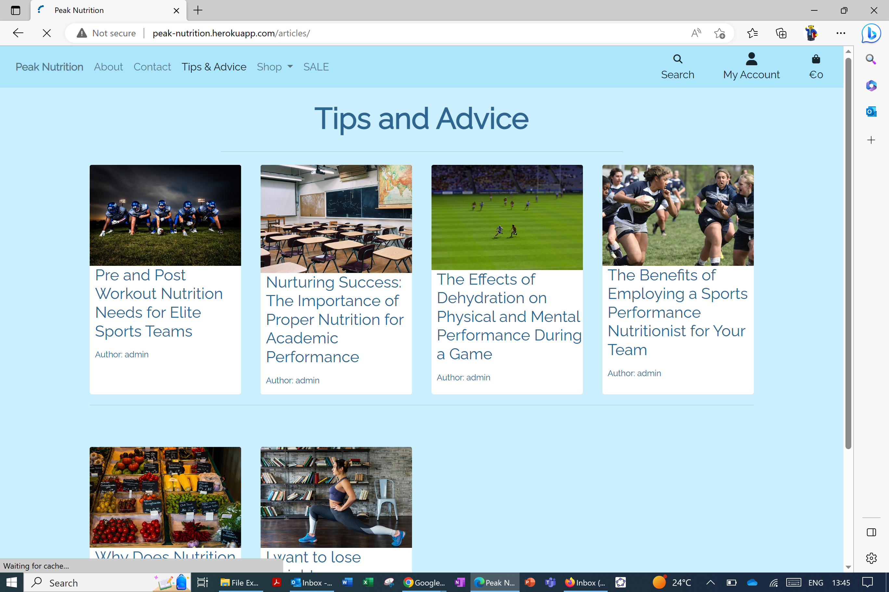

[Back to top](<#contents>)

### Lighthouse Tests

#### Mobile

[Mobile Link](https://pagespeed.web.dev/analysis/https-peak-nutrition-herokuapp-com/efkpd2vz35?form_factor=mobile)

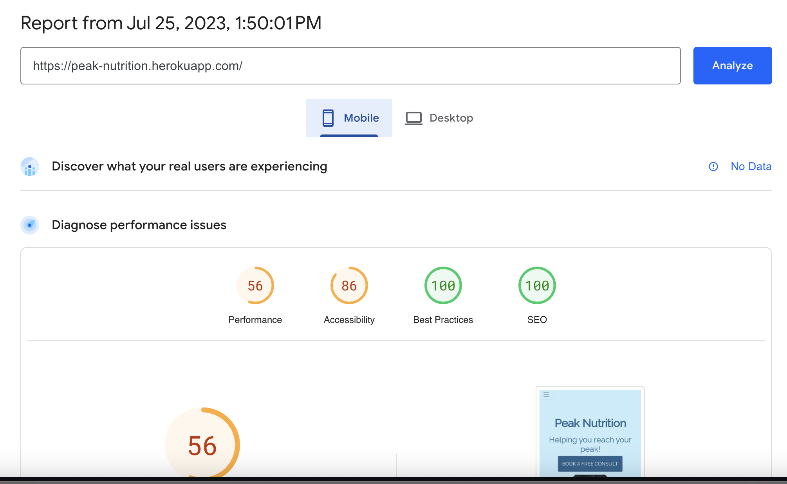

Page speed on mobile is 56. When looking at the detailed breakdown it give the following:

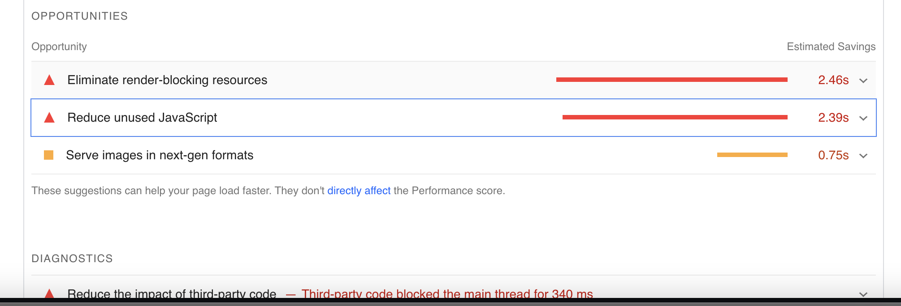

These are connected to the JS scripts related to stripe which we have no control over.

#### Desktop

[Desktop link](https://pagespeed.web.dev/analysis/https-peak-nutrition-herokuapp-com/efkpd2vz35?form_factor=desktop)

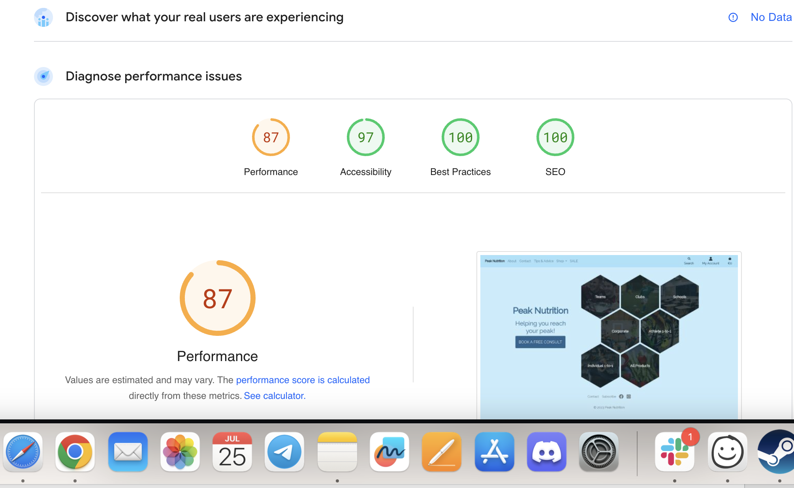

[Back to top](<#contents>)

## Bugs

### Resolved 

**Bug** | **Cause** | **Outcome**
------------ | ------------ | ------------ |
Images were showing up tiny on products page | Missing semi-colon in CSS file | Resolved |
All users were able to access CRUD functions  | Didn't have authentication set up across the site | Resolved |
Checkout toast message showed code {order.email} | Missing f in front of line | Resolved |
About.html image was not scaling | Added width = 100% | Resolved |
Default image wasn't loading for articles | Correct media path not included in src path | Resolved

[Back to top](<#contents>)

### Unresolved

**Bug** | **Cause** | **Outcome**
------------ | ------------ | ------------ |
HTML validator error | Stray 
 tag on About.html | Unable to resolve. No stray tag found. Mentor checked it to no avail |

[Back to top](<#contents>)

## Deploying the site

### Heroku app setup 
- Click the New button in the top right corner of the Heroku dashboard and choose Create New App.
- Give your app a name (this must be unique)
- Select the region that is closest to you (EU)
- Click the create app button bottom left.

- Set all the values of the Heroku settings from your env.py
- The value of a new configuration variable called DATABASE URL is created in the settings tab
- Copy this value from the elephantSQL console
- Be careful to get the right variables for AWS and email, without any new lines/carriage returns, which could cause server failure 500.

[Back to top](<#contents>)

### Preparation for deployment
- Install dj_database_url and psycopg2, needed for connecting to your external ElephantSQL database 
        pip3 install dj_database_url==0.5.0 psycopg2
- Update your requirements.txt file
        pip3 freeze > requirements.txt
- In settings.py underneath import os, add import dj_database_url
- Locate the section for DATABASES and comment out the code. Add the following code below the commented out code, and use the URL copied from elephantSQL for the value:
        DATABASES = {
        'default': dj_database_url.parse('paste-elephantsql-db-url-here')
        }
- In the terminal, run the show migrations command to confirm connection to the external database.
        python3 manage.py showmigrations
- If it is connected to the database, you will see a list of unchecked migrations
- Now run migrations to migrate the models to the new database:
        python3 manage.py migrate
- Create a superuser for the new database.
        python3 manage.py createsuperuser
- Input a username, email and password when prompted.
- You should now be able to go to the browser tab on the left of the page in elephantsql, click the table queries button and see the user you've just created by selecting the auth_user table.

[Back to top](<#contents>)

- Now you can add an if/else statement for the databases in settings.py, so that so you can use the development database while in development and the external database on the live site
        if 'DATABASE_URL' in os.environ:
    DATABASES = {
      'default': dj_database_url.parse(os.environ.get('DATABASE_URL'))
    }
else:
    DATABASES = {
        'default': {
            'ENGINE': 'django.db.backends.sqlite3',
            'NAME': os.path.join(BASE_DIR, 'db.sqlite3')
      }
    }
- Install gunicorn which will act as our web server and freeze this to the requirements.txt file.
        pip3 install gunicorn pip3 freeze > requirements.txt
- Create a Procfile in the root directory. This instructs Heroku to build a web dyno that serves our Django app and runs Gunicorn.
- Add the following code in the procfile
        web:  gunicorn policyshop.wsgi:application
- Disable collectstatic by running the following command in the terminal
        heroku config:set DISABLE_COLLECTSTATIC=1 --app heroku--your-app-name-here
- Add the Heroku app and localhost by adding the following code in the settings.py
        ALLOWED_HOSTS = ['{heroku deployed site URL here}', 'localhost' ]
- Save, add, commit and push the changes to GitHub.
        heroku git:remote -a {app name here}
        git push heroku master
- The deployed site is available to see now. You won't see any static file as we have not set that up yet.
- To enable automatic deploys on Heroku, click enable automatic deploys at the bottom of the page.

[Back to top](<#contents>)

### Generate a SECRET KEY

- When you start a project in Django, a secret key is immediately generated
- We should not use this key in our deployed version as it makes our website insecure.
- And we should not commit this detail in github, so it should be an excluded file in any commits.
- Same for other secret keys for AWS and Stripe below.
- We can use a random key generator to create a new SECRET_KEY which we can then add to our Heroku config vars which will then keep the key protected.
- [Django Secret Key Generator](https://miniwebtool.com/django-secret-key-generator/) is where we can generate a secret key
- Create a new key and copy the key
- Create a new config var with the key SECRET KEY in the Heroku settings.
- Update the SECRET_KEY in the settings.py
    SECRET_KEY = os.environ.get('SECRET_KEY', ' ')
- Update the debug variable to true if in development
        DEBUG = 'DEVELOPMENT' in os.environ
- Save, add, commit and push these changes.

[Back to top](<#contents>)

### Setting up AWS

- Sign up or login to your aws [amazon account](https://aws.amazon.com/) on the top right by using the manage my account button
- Then navigate to S3 to create a new bucket. This bucket will store our project files.
- Select the closest region to you (EU for us).
- Selecting ACLs enabled and then bucket owner preferred are required in the object ownership section.
- Uncheck the block public access box in the block public access section
- Tick the acknowledge button to make the bucket public. Then click create bucket.
- Select the properties tab from the bucket you just created
- Find the static web hosting section and choose enable static web hosting.
- Enter index.html and error.html for the index and error documents
- Open the permissions tab and copy the ARN (Amazon Resource Name).
- Go to the bucket policy section, select Edit, and then choose Policy Generator.
- The policy type will be S3 bucket policy, we want to allow all principles by adding * to the input and the actions will be get object.
- Click "add statement" after pasting the ARN we copied from the previous page into the ARN input.
- Click generate policy and copy the policy that displays in a new pop up.
- Paste this policy into the bucket policy editor and make the following changes: Add a /* at the end of the resource value. Click save.
-  Edit the the cross-origin resource sharing (CORS) and paste in the following text:
        [
            {
                "AllowedHeaders": [
                    "Authorization"
                ],
                "AllowedMethods": [
                    "GET"
                ],
                "AllowedOrigins": [
                    "*"
                ],
                "ExposeHeaders": []
            }
        ]
- Edit the access control list (ACL) section. Click edit and enable list for everyone(public access) and accept the warning box.

[Back to top](<#contents>)

### Creating AWS groups, policies and users

- To manage access to AWS services, go to IAM by clicking the services icon in the top right corner of the page. Click User Groups from the left-hand navigation menu, and then click the Create Group button in the top-right corner. This will establish the group in which our user will be included. 
- Choose a name for your group and click the create policy button on the right. This will open a new page.
- To import managed policy, click the link in the top right corner of the page after selecting the JSON tab.
- Search for S3 and select the one called AmazonS3FullAccess, then click import.
- To make a change to the resources, we need to make resources an array and then change the value for the resources. Instead of a * which allows all access, we want to paste in our ARN. followed by a comma, and then paste the ARN in again on the next line with /* at the end. This permits all operations on our bucket and all of its resources.
- Click the next: tags button and then the next - review
- Give the policy a name and description (e.g. alltours-policy | Access to S3 bucket for seaside sewing static files.) Click the create policy button.
- To attach policy click User Groups from the left-hand navigation menu, select the group, and then select the Permissions tab.
- Select "attach policies" from the dropdown menu after clicking the add permissions button on the right.
- Select the policy you just created and then click add permissions at the bottom.
- Create a user for the group by clicking on the user link in the left hand navigation menu.
- Click the add users button on the top right and giving our user a username (e.g. policyshop-staticfiles-user). 
- Select programmatic access and then click the next: permissions button.
- Add the user to the group you just created and then click next:tags button, next:review button and then create user button.
- As we need to insert the user access key and secret access key into the Heroku config vars, you will now need to download the CSV file. You won't be able to view the CSV again, so be sure to download it now.

[Back to top](<#contents>)

### Connecting Django to AWS S3 bucket

- Install boto3 and django storages 
        pip3 install boto3
        pip3 install django-storages
- freeze them to the requirements.txt file
        pip3 freeze > requirements.txt
- Add storages to the installed apps in settings.py
- Add the following code in settings.py to use our bucket
        if 'USE_AWS' in os.environ:
            AWS_S3_OBJECT_PARAMETERS = {
                'Expires': 'Thu, 31 Dec 2099 20:00:00 GMT',
                'CacheControl': 'max-age=9460800',
            }
       
            AWS_STORAGE_BUCKET_NAME = 'enter your bucket name here'
            AWS_S3_REGION_NAME = 'enter the region you selected here'
            AWS_ACCESS_KEY_ID = os.environ.get('AWS_ACCESS_KEY_ID')
            AWS_SECRET_ACCESS_KEY = os.environ.get('AWS_SECRET_ACCESS_KEY')
            AWS_S3_CUSTOM_DOMAIN = f'{AWS_STORAGE_BUCKET_NAME}.s3.amazonaws.com'

            # Static and media files
            STATICFILES_STORAGE = 'custom_storages.StaticStorage'
            STATICFILES_LOCATION = 'static'
            DEFAULT_FILE_STORAGE = 'custom_storages.MediaStorage'
            MEDIAFILES_LOCATION = 'media'

            # Override static and media URLs in production
            STATIC_URL = f'https://{AWS_S3_CUSTOM_DOMAIN}/{STATICFILES_LOCATION}/'
            MEDIA_URL = f'https://{AWS_S3_CUSTOM_DOMAIN}/{MEDIAFILES_LOCATION}/'

[Back to top](<#contents>)

- We can now add these keys to our configuration variables in Heroku:

    | KEY                       | VALUE         |
    | -------------             | ------------- |
    | `AWS_ACCESS_KEY_ID`       | PasteThe access key value from the amazon csv file downloaded in the last section         |
    | `AWS_SECRET_ACCESS_KEY`   | Paste The secret access key from the amazon csv file downloaded in the last section         |
    | `USE_AWS`                 | True         |

- Remove the DISABLE_COLLECTSTATIC variable.
- Create a file called custom_storages.py in the root directory.
- import settings and S3Botot3Storage. Create a custom class for static files and one for media files.
- Add the following code to file you created just now
        """ Custom storages for AWS file storage. """
        from django.conf import settings
        from storages.backends.s3boto3 import S3Boto3Storage

        class StaticStorage(S3Boto3Storage):
            location = settings.STATICFILES_LOCATION

        class MediaStorage(S3Boto3Storage):
            location = settings.MEDIAFILES_LOCATION

- In order to override the static and media URLs in production and update the app where to put static and media assets, add the following to settings.py.

        STATICFILES_STORAGE = 'custom_storages.StaticStorage'
        STATICFILES_LOCATION = 'static'
        DEFAULT_FILE_STORAGE = 'custom_storages.MediaStorage'
        MEDIAFILES_LOCATION = 'media'

        STATIC_URL = f'https://{AWS_S3_CUSTOM_DOMAIN}/{STATICFILES_LOCATION}/'
        MEDIA_URL = f'https://{AWS_S3_CUSTOM_DOMAIN}/{MEDIAFILES_LOCATION}/'

- Save everything, add, commit and push these changes to make a deployment to Heroku.
- Navigate to S3 and open your bucket. 
- Click the create folder button on the top right and naming the folder media. This is where we will save all out media files.

[Back to top](<#contents>)

### Stripe Setup

- Log into Stripe, click developers and then API keys.
- Copy the publishable key (STRIPE_PUBLIC_KEY) and the secret key (STRIPE_SECRET_KEY) 
- Log in to heroku and create 2 new variables in Heroku's config vars, publishable key is STRIPE_PUBLIC_KEY and the secret key is STRIPE_SECRET_KEY and paste values copied from stripe
- To add webhooks go to the WebHooks link in the menu on the left and select the add endpoint option.
- Add the URL for our deployed sites WebHook, give it a description and then click the add events button and select all events. Click Create endpoint.
- add the WebHook signing secret to our Heroku config variables as STRIPE_WH_SECRET.
- Paste the following code in settings.py

        STRIPE_PUBLIC_KEY = os.getenv('STRIPE_PUBLIC_KEY', '')
        STRIPE_SECRET_KEY = os.getenv('STRIPE_SECRET_KEY', '')
        STRIPE_WH_SECRET = os.getenv('STRIPE_WH_SECRET', '')

[Back to top](<#contents>)

### Forking

You can Fork the Repository. This makes a copy of the original repository on our Github account so you can make changes without affecting the original repository.
1. Log into GitHub and locate the GitHub repository you want.
2. Click on the "Fork" button which is in the top right corner.
3. You will now have a copy of the original repository in your GitHub account.

[Back to top](<#contents>)

### Cloning

1. Log into GitHub and locate the GitHub repository you want.
2. Under the repository name, click "Code" button which will produce a dropdown menu.
3. Where it says Clone, copy the link below.

[Link to deployed site](https://peak-nutrition.herokuapp.com/)

[Back to top](<#contents>)

# Credits

## Content

All content is original. Articles were generated by ChatGPT: (https://chat.openai.com/)

[Back to top](<#contents>)

## Readme
Readme structure adapted from/inspired by:
- My own PP4: Adventures with Wood readme: (https://github.com/culanomeara/adventureswithwood/blob/main/README.md)
- Jenny Delaney: (https://github.com/Code-Institute-Submissions/pp5-JennyDelaney/blob/main/documents/DEPLOYMENT.md)

[Back to top](<#contents>)

## Media

Free images were sourced on Pixabay. Creative commons images were used. (https://pixabay.com/accounts/collections/15375957/)

[Back to top](<#contents>)

## Code 

I used the "Boutique Ado" walk through product as a starting point and template. I created an e-commerce site that presented products and articles. I added to the base code with custom views, models, html and CSS. I used the JS script for toast messages from that blog and modified it for my own requirements.

I got the code for Hexagons from Paper Dreams (https://paper-dreams-uk.herokuapp.com/)
I referenced Stack Overflow for code snippets where my code wasn't performing as required.

[Back to top](<#contents>)
